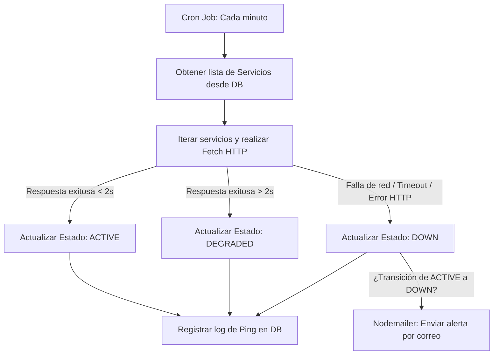

# StatusWatch — Panel de Monitoreo de Servicios en Tiempo Real

## Borrador de Entrega del Proyecto - Módulo 5 (Informe y Documentación de Diseño)

**Curso:** Desarrollo de Software / Aplicaciones Móviles  
**Estudiante:** Sebastian Benavides  
**Término Académico:** 2026  
**Proyecto:** StatusWatch  
**Versión del Entregable:** v0.3.0  

---

## 1. Descripción del Proyecto

**StatusWatch** es una solución integral y auto-alojable (self-hosted) para el monitoreo de disponibilidad, estado y rendimiento de servicios web, APIs, bases de datos y servidores en tiempo real. 

El proyecto consta de una arquitectura desacoplada:
*   **Backend:** Una API REST robusta construida con **Node.js, Express y TypeScript**, utilizando **Prisma ORM** para la persistencia de datos en una base de datos **PostgreSQL**. Incorpora un motor de tareas programadas (`node-cron`) para realizar pings periódicos y un sistema de envío de correos electrónicos (`Nodemailer`) para alertas automáticas.
*   **Frontend / UI:** Una aplicación web responsiva en **Next.js** con soporte para TypeScript, estilizada con **Tailwind CSS**. Proporciona una página pública interactiva sin necesidad de registro, así como un panel de administración privado y seguro (JWT) para gestionar la configuración de los servicios.

StatusWatch está diseñado pensando en la simplicidad y en el rendimiento, ofreciendo un panel de control rápido e intuitivo que puede visualizarse en cualquier navegador de escritorio o móvil, y que puede ser empaquetado para plataformas móviles híbridas.

---

## 2. Exposición del Problema

En el ecosistema moderno del software, la alta disponibilidad y la fiabilidad de las aplicaciones en línea son pilares fundamentales para el éxito del negocio. Las caídas o degradaciones no detectadas a tiempo en las dependencias de backend (como pasarelas de pago, servidores de autenticación o bases de datos) provocan pérdidas financieras directas, insatisfacción de los usuarios y un impacto negativo en la reputación de la organización.

### La Brecha en el Mercado
Aunque existen plataformas de monitoreo consolidadas en el sector empresarial (como Datadog, New Relic, Dynatrace o Statuspage.io), estas presentan barreras críticas de adopción para desarrolladores independientes, startups y organizaciones medianas:
1.  **Costos Prohibitivos:** Los planes de pago escalan agresivamente según el volumen de métricas o el número de servicios monitoreados.
2.  **Complejidad en la Configuración:** Requieren la instrumentación profunda del código del sistema o la instalación de agentes de servidor pesados y difíciles de configurar.
3.  **Monopolio de Datos y Privacidad:** La telemetría sensible y los registros de fallas son enviados a servidores externos de terceros, lo que puede incumplir normativas locales de soberanía de datos.

### La Solución StatusWatch
StatusWatch resuelve estas problemáticas ofreciendo un panel de monitoreo **liviano, personalizable y auto-alojable**. Se ejecuta dentro de contenedores independientes mediante Docker, ofreciendo a las organizaciones el control total de sus datos de monitoreo sin costo de licenciamiento de terceros y con una configuración simple de menos de 5 minutos.

---

## 3. Plataforma y Compatibilidad Móvil

StatusWatch ha sido desarrollado bajo un paradigma **Mobile-First** empleando tecnologías web de última generación:

*   **Páginas Web Responsivas:** El frontend web se adapta automáticamente a cualquier resolución de pantalla (teléfonos móviles, tabletas, portátiles y monitores ultra-anchos) gracias a una rejilla fluida en Tailwind CSS.
*   **Compatibilidad Móvil Nactiva (Híbrida):** A pesar de ejecutarse por defecto como un servidor web tradicional, la arquitectura desacoplada de la UI permite utilizar frameworks contenedores como **Capacitor (Ionic)** o **Cordova**. Esto permite compilar la base de código de Next.js en un proyecto de **Android Studio** o **Xcode**, generando archivos instalables (`.apk` y `.ipa`) para dispositivos móviles físicos.
*   **Simulación en Emuladores:** El sistema se puede desplegar localmente y auditarse en tiempo real desde el emulador de Android Studio ingresando a la dirección IP especial del puente de red `http://10.0.2.2:3000`.

---

## 4. Interfaz de Usuario (UI) e Interfaz de Administrador

El sistema se divide claramente en dos capas de presentación con accesos diferenciados:

### A. Interfaz de Usuario Pública (Sin Autenticación)
Es la cara visible al cliente/usuario final del servicio. Diseñada para ser simple, informativa y limpia.
*   **Estado General de la Infraestructura:** Un indicador visual superior de gran tamaño que utiliza colores semánticos (Verde: Operativo, Amarillo: Degradado, Rojo: Caído) indicando el estado del ecosistema completo.
*   **Tarjetas de Servicios:** Cada servicio monitoreado se detalla con su nombre, tiempo de respuesta promedio en los últimos pings y su porcentaje de disponibilidad (Uptime) calculado sobre una ventana histórica de 30 días.
*   **Panel de Incidentes Recientes:** Muestra de manera cronológica inversa los incidentes declarados por el equipo técnico, con su título, descripción de la falla, severidad (Menor, Mayor, Crítico) y estado actual de resolución.

### B. Interfaz de Administrador (Con Autenticación Segura)
Panel restringido para el equipo de operaciones de TI.
*   **Formulario de Login:** Autenticación protegida por JWT (Tokens de acceso de vida corta de 15 min y tokens de refresco persistentes de 7 días).
*   **Dashboard CRUD de Servicios:** Listado interactivo donde el administrador puede:
    *   *Crear:* Agregar nuevas URLs a monitorear indicando nombre, dirección web e intervalo de chequeo.
    *   *Editar/Actualizar:* Modificar los parámetros del servicio.
    *   *Eliminar:* Remover permanentemente un servicio y sus históricos de la base de datos.
    *   *Ping Manual:* Botón para forzar una llamada de red inmediata y actualizar las métricas al instante.
*   **Gestor de Incidentes:** Formulario para registrar nuevos reportes de incidentes, clasificar su estado (Investigando, Identificado, Monitoreando, Resuelto) e ingresar bitácoras de avance.
*   **Configuración de Alertas Correo (SMTP):** Configuración de variables de entorno para vincular un servicio de correo saliente que envíe correos automatizados en caso de fallas.

---

## 5. Funcionalidad del Sistema

El flujo operativo y las capacidades del backend de StatusWatch se detallan a continuación:



### Características Funcionales Clave:
1.  **Chequeo de Disponibilidad Automatizado:** Un proceso cron que corre en segundo plano evalúa las URLs a intervalos regulares, enviando un request y midiendo el tiempo de respuesta.
2.  **Configuración de Tolerancia a Fallas:** Se valida el código de retorno HTTP (`ok = res.status >= 200 && res.status < 300`).
3.  **Transiciones de Estado de Servicio:**
    *   `ACTIVE`: Respuesta rápida y correcta.
    *   `DEGRADED`: El servicio responde pero tarda más de 2000 ms (latencia alta).
    *   `DOWN`: Error de red de bajo nivel, DNS fallido, timeout de 5 segundos, o código de estado HTTP 4xx/5xx.
4.  **Sistema de Notificación Inmediata (Nodemailer):** Envío de alertas automatizadas por correo electrónico en formato HTML al administrador técnico registrado cuando se confirma una transición de estado a `DOWN`.

---

## 6. Diseño: Esquema de Páginas y Wireframes

A continuación se presentan los esquemas estructurales de las pantallas principales en formato de wireframes en texto:

### Wireframe 1: Vista Pública (`/`)
```text
+-----------------------------------------------------------------------------+
|  [Logo] StatusWatch                                          [ Acceso Admin ]|
+-----------------------------------------------------------------------------+
|                                                                             |
|   +---------------------------------------------------------------------+   |
|   |  ● TODO OPERATIVO - Todos los servicios funcionan correctamente     |   |
|   +---------------------------------------------------------------------+   |
|                                                                             |
|   SERVICIOS MONITOREADOS                                                    |
|   +---------------------------------------------------------------------+   |
|   | API Gateway                 [ ACTIVO ]    Uptime: 99.98%   Lat: 120ms|   |
|   +---------------------------------------------------------------------+   |
|   | Servidor de Base de Datos   [ ACTIVO ]    Uptime: 100.0%   Lat:  45ms|   |
|   +---------------------------------------------------------------------+   |
|   | Portal Web Principal        [ ACTIVO ]    Uptime: 99.90%   Lat: 210ms|   |
|   +---------------------------------------------------------------------+   |
|                                                                             |
|   INCIDENTES RECIENTES                                                      |
|   +---------------------------------------------------------------------+   |
|   | Mantenimiento Programado - Base de datos               [ RESUELTO ] |   |
|   | Se realizó la migración de esquemas sin cortes en el servicio.      |   |
|   | Publicado: 2026-06-28 10:00 UTC                                     |   |
|   +---------------------------------------------------------------------+   |
+-----------------------------------------------------------------------------+
```

### Wireframe 2: Dashboard de Administración (`/admin/dashboard`)
```text
+-----------------------------------------------------------------------------+
|  [Logo] StatusWatch - Panel de Operaciones                    [ Cerrar Sesión ]|
+-----------------------------------------------------------------------------+
|                                                                             |
|   +-------------------+  +-------------------------+  +-----------------+   |
|   | Servicios: 3      |  | Promedio Latencia: 125ms|  | Incidentes: 0   |   |
|   +-------------------+  +-------------------------+  +-----------------+   |
|                                                                             |
|   GESTIÓN DE SERVICIOS                          [ + Agregar Nuevo Servicio ] |
|   +---------------------------------------------------------------------+   |
|   | API Gateway                 [ ACTIVO ]   [ Ping ]  [ Editar ]  [ x ]    |
|   +---------------------------------------------------------------------+   |
|   | Portal Web Principal        [ ACTIVO ]   [ Ping ]  [ Editar ]  [ x ]    |
|   +---------------------------------------------------------------------+   |
|                                                                             |
|   REGISTRO DE INCIDENTES                           [ + Crear Incidente ]    |
|   +---------------------------------------------------------------------+   |
|   | No hay incidentes activos en este momento.                          |
|   +---------------------------------------------------------------------+   |
+-----------------------------------------------------------------------------+
```

---

## 7. Registros de Cambios (Changelog)

Todos los cambios y avances del proyecto a lo largo del periodo académico se detallan a continuación utilizando la especificación estandarizada de *Keep a Changelog*:

### [v0.3.0] - Módulo 5 (Entregable Actual)
#### Agregado
*   Backend real en Express.js con soporte completo para TypeScript.
*   Esquema de base de datos relacional PostgreSQL modelado con Prisma ORM.
*   Autenticación de administrador robusta usando JWT con tokens de acceso y de refresco.
*   Servicio de monitoreo programado (`node-cron`) que realiza peticiones periódicas reales a los servicios web.
*   Sistema de alertas automatizadas de caídas a través de correos electrónicos (`Nodemailer`).
*   Integración completa en el frontend (`lib/api.ts`) conectando el panel Next.js con los endpoints reales del backend.
*   Orquestación de infraestructura local completa mediante contenedores de Docker (`Dockerfile` en raíz, `Dockerfile` en backend y archivo `docker-compose.yml`).
*   Base de datos inicializada automáticamente mediante scripts de base de datos (`seed.ts`) creando el usuario administrador y servicios por defecto.

#### Modificado
*   El archivo de interfaz de Next.js `components/status-watch-app.jsx` fue re-factorizado para eliminar la simulación de datos (mock data) y realizar peticiones asíncronas reales a la API.

---

### [v0.2.0] - Módulo 4
#### Agregado
*   Diagramas y flujos de arquitectura técnica de tres capas (Cliente UI, Servidor REST API, Base de Datos).
*   Especificación y documentación de endpoints REST para la API de autenticación, servicios e incidentes.
*   Creación de wireframes digitales interactivos en Figma para dispositivos móviles y de escritorio.

#### Modificado
*   Borrador general de requisitos de la interfaz de administración enriquecido con la definición de la lógica de negocio para incidentes.

---

### [v0.1.0] - Módulo 3
#### Agregado
*   Borrador inicial del proyecto definiendo el alcance, objetivos y limitaciones tecnológicas.
*   Identificación de la problemática global y justificación de desarrollo.
*   Diseño lógico inicial de base de datos en papel.
*   README inicial del repositorio.

---

## 8. Arquitectura y Stack Tecnológico

El proyecto está diseñado bajo un modelo de arquitectura limpia y desacoplada:

| Componente | Tecnología Seleccionada | Justificación |
| :--- | :--- | :--- |
| **Frontend** | Next.js 19 + TypeScript | Permite renderizado del lado del servidor (SSR) veloz y tipado seguro. |
| **Backend** | Node.js + Express.js | Ligero, modular y altamente eficiente para operaciones I/O asíncronas. |
| **Base de Datos**| PostgreSQL | Base de datos relacional madura, íntegra y optimizada para producción. |
| **ORM** | Prisma ORM | Simplifica las consultas, migraciones y provee autocompletado robusto. |
| **Contenedores** | Docker & Docker Compose | Garantiza entornos idénticos en desarrollo, pruebas y producción. |
| **Alertas** | Nodemailer (SMTP) | Facilidad de integración para despachar correos electrónicos estándar. |

---

## 9. Instrucciones de Despliegue Local

### Requisitos Previos
*   **Docker** y **Docker Compose** instalados en tu equipo.
*   (Opcional para desarrollo directo): **Node.js v20+** y **pnpm** instalados.

### Despliegue Rápido con Docker (Recomendado)
1.  Clona el repositorio e ingresa a la carpeta:
    ```bash
    git clone https://github.com/enau/statuswatch
    cd statuswatch
    ```
2.  Crea el archivo de configuración de variables de entorno en el servidor:
    ```bash
    cp server/.env.example server/.env
    ```
3.  Levanta la base de datos, el backend y el frontend en un solo comando:
    ```bash
    docker compose up --build -d
    ```
4.  La aplicación estará lista en:
    *   **Frontend Público / Admin:** `http://localhost:3000`
    *   **Backend API REST:** `http://localhost:4000`
    *   **Credenciales por Defecto del Admin (Seed):**
        *   **Usuario:** `admin@statuswatch.com`
        *   **Contraseña:** `admin123`

---

*Proyecto académico de desarrollo de software - Creado por Sebastian Benavides.*